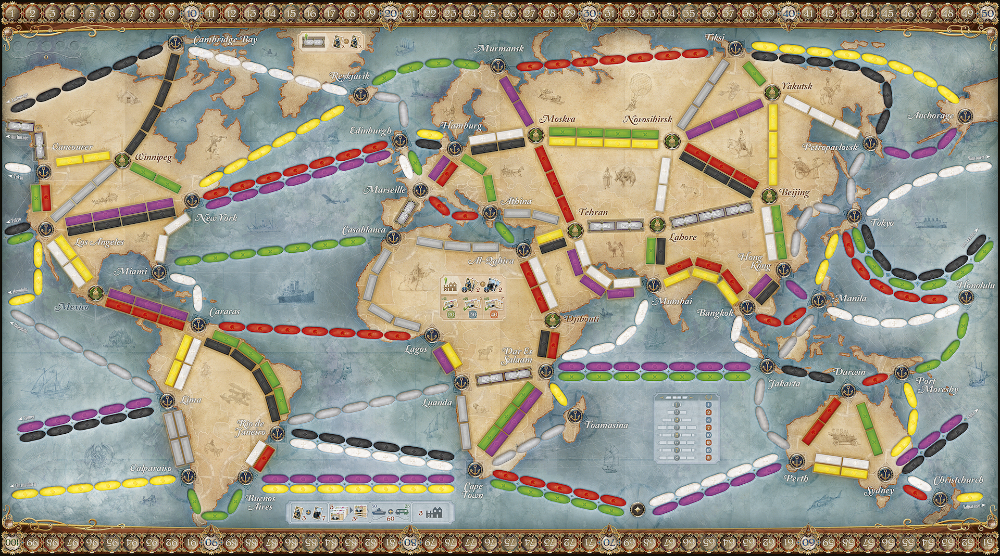

# AventurierDuRail-AdM-

Programme en lien avec le jeu de plateau "Les Aventuriers du Rail" édition Autour du Monde (AdM).




Ce programme permet plusieurs choses :

- Connaître toutes les cartes destinations du jeu (départ, arrivée, points)
- Connaître toutes les cartes destinations en liens avec une ville

 Le point le plus important est l'optimisation de chemin. En effet, le but des Aventuriers du Rail est de réaliser des destinations afin de gagner des points. Le joueur ayant le plus de points à la fin de la partie gagne.
 Ainsi l'optimisation de chemin est primordiale.

 Une option du programme est d'entrer des destinations et une autre option permet de calculer le plus court chemin, en terme de pions (wagons/bateaux) posés.

 Enfin une dernière option est la mise à jour du plateau. Le plateau évolue et des routes sont utilisées. Il faut donc adapter le plus court chemin à l'état actuel du plateau. Vous pouvez donc mettre à jour le plateau afin de recalculer le nouveau meilleur chemin pour vos destinations.


 ## Aspects non implémentés et/ou mal implémentées

 - Mauvaise gestion des itinéraires dans le plus court chemin
 - Ne prend pas en compte les cartes et le nombre de pions du joueur
 - Modifications textuelles à faire
 - Ports

## Explication des fichiers

- ```Aretes.py``` : contient la classe ```Arete``` ainsi que la classe ```PassageDifficile``` (cette dernère hérite d'```Arete```)
- ```Destinations.py``` : contient la classe ```Destination``` ainsi que la classe ```Itineraire``` (cette dernière hérite de ```Destination```
- ```Graphe.py``` : contient la classe ```Graphe```. Cette classe définit toutes les villes et toutes les arêtes (chemins entre les villes) du plateau.
- ```main.py``` : contient le programme principal. Doit être lancé pour utiliser l'application
- ```Map.py``` : contient le plateau (donc un objet de la classe ```Graphe```) ainsi que toutes les cartes destinations
- ```Villes.py``` : contient la classe ```Ville```

